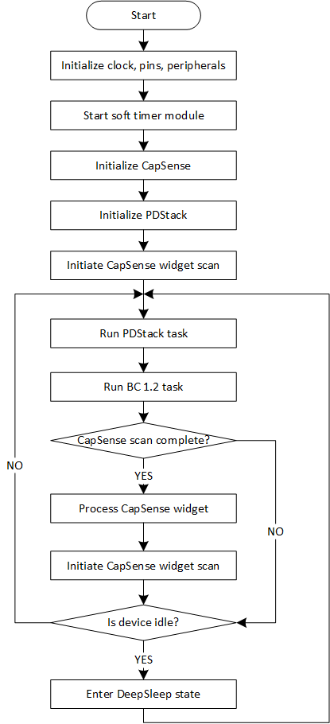
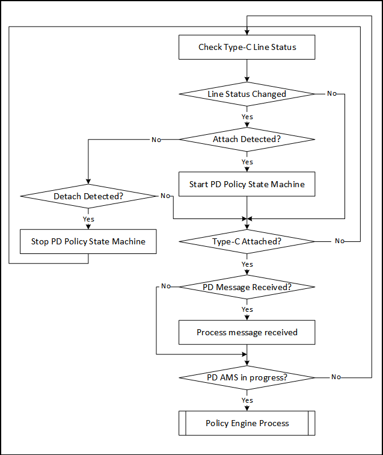
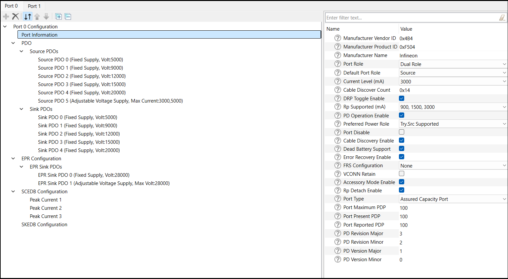
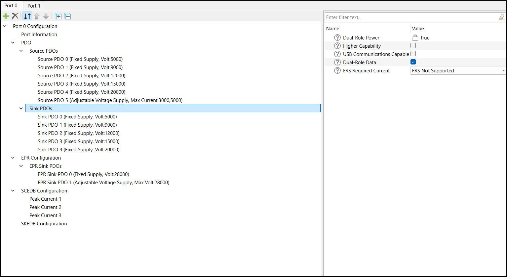
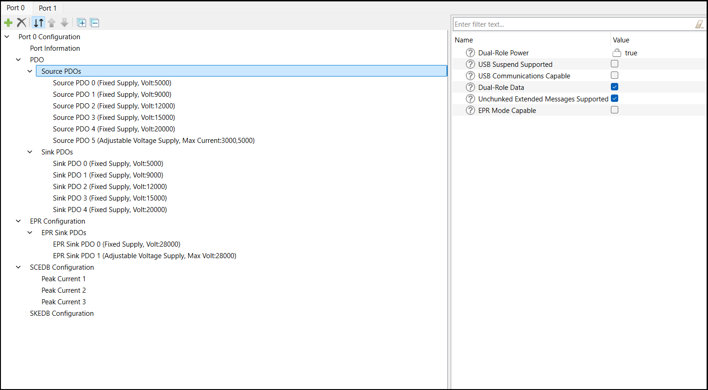
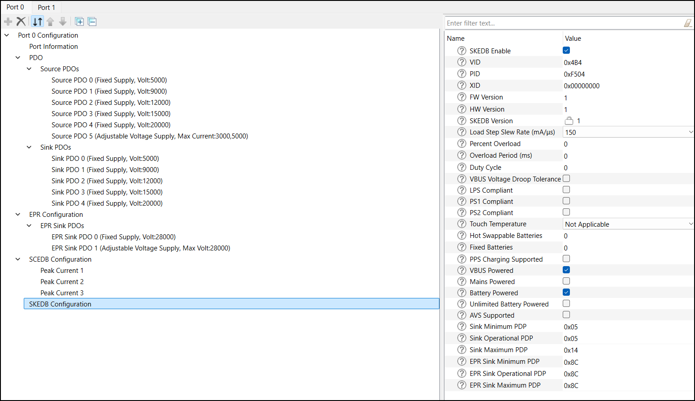
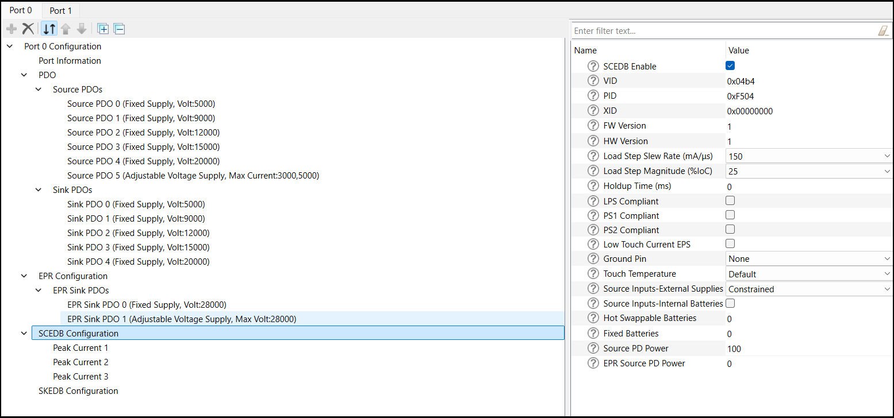
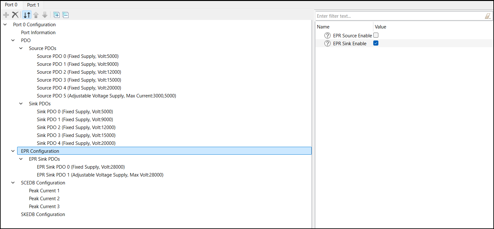

# EZ-PD&trade; PMG1 MCU: USB PD Dual-Role Power (DRP) CAPSENSE&trade;

This code example demonstrates USB-C attach detection and USB Power Delivery (PD) contract negotiation using EZ-PD&trade; EVAL_PMG1_S3_DUALDRP Evaluation Kit as a Dual-Role Power (DRP) controller. This code example provides up to a 100 W (20 V at 5 A) Standard Power Range (SPR) Power Delivery contract in source mode and request up to a 140 W (28 V at 5 A) Extended Power Range (EPR) Power Delivery contract in sink mode. This example also features a five-segment CAPSENSE&trade; slider and two CAPSENSE&trade; buttons. Each CAPSENSE&trade; sensor toggles an LED and triggers renegotiation of the power delivery contract to get different VBUS voltages based on the touch input from the user.

[View this README on GitHub.](https://github.com/Infineon/mtb-example-pmg1-usbpd-drp-capsense)

[Provide feedback on this code example.](https://cypress.co1.qualtrics.com/jfe/form/SV_1NTns53sK2yiljn?Q_EED=eyJVbmlxdWUgRG9jIElkIjoiQ0UyMzgyODEiLCJTcGVjIE51bWJlciI6IjAwMi0zODI4MSIsIkRvYyBUaXRsZSI6IkVaLVBEJnRyYWRlOyBQTUcxIE1DVTogVVNCIFBEIER1YWwtUm9sZSBQb3dlciAoRFJQKSBDQVBTRU5TRSZ0cmFkZTsiLCJyaWQiOiJuc2giLCJEb2MgdmVyc2lvbiI6IjEuMC4wIiwiRG9jIExhbmd1YWdlIjoiRW5nbGlzaCIsIkRvYyBEaXZpc2lvbiI6Ik1DRCIsIkRvYyBCVSI6IldJUkVEIiwiRG9jIEZhbWlseSI6IlRZUEUtQyJ9)


## Requirements


- [ModusToolbox&trade;](https://www.infineon.com/modustoolbox) v3.3 or later (tested with v3.3)
- Board support package (BSP) minimum required version: 3.2.0
- Programming language: C
- Associated parts: [EZ-PD&trade; PMG1-S3 MCU](https://www.infineon.com/cms/en/product/universal-serial-bus/usb-c-high-voltage-microcontrollers/ez-pd-pmg1-s3-high-voltage-mcu-with-usb-c-pd)


## Supported toolchains (make variable 'TOOLCHAIN')

- GNU Arm&reg; Embedded Compiler v11.3.1 (`GCC_ARM`) – Default value of `TOOLCHAIN`
- Arm&reg; Compiler v6.22 (`ARM`)
- IAR C/C++ Compiler v9.50.2 (`IAR`)

## Supported kits (make variable 'TARGET')

- [EZ-PD&trade; EVAL_PMG1_S3_DUALDRP Evaluation Kit](https://www.infineon.com/EVAL_PMG1_S3_DUALDRP) (`EVAL_PMG1_S3_DUALDRP`)


## Hardware setup

1. Connect the board to your PC using the USB cable through the KitProg3 Type-C connector (J1). This cable is used for programming the EZ-PD&trade; PMG1 device and during debugging.

2. Connect the USB PD port (J10 or J14) to the USB-C power adapter or your PC using the USB Type-C cable. This cable is used for the USB Power Delivery source and it provides power to the respective user LED.

> **Note:** To test the EPR feature, you need a 140 W USB-C PD power adapter and a 140 W EPR USB-C-to-USB-C cable.

See the kit [user guide] (https://www.infineon.com/dgdl/Infineon-User_guide_evaluation_kit_eval_pmg1_s3_dualdrp-UserManual-v03_00-EN.pdf?fileId=8ac78c8c919c9f9d0192253a44713fd6) for more details on configuring the board.

## Software setup

See the [ModusToolbox&trade; tools package installation guide](https://www.infineon.com/ModusToolboxInstallguide) for information about installing and configuring the tools package.

This code example does not need any additional software or tools.


## Using the code example

### Create the project

The ModusToolbox&trade; tools package provides the Project Creator as both a GUI tool and a command line tool.

<details><summary><b>Use Project Creator GUI</b></summary>

1. Open the Project Creator GUI tool.

   There are several ways to do this, including launching it from the dashboard or from inside the Eclipse IDE. For more details, see the [Project Creator user guide](https://www.infineon.com/ModusToolboxProjectCreator) (locally available at *{ModusToolbox&trade; install directory}/tools_{version}/project-creator/docs/project-creator.pdf*).

2. On the **Choose Board Support Package (BSP)** page, select a kit supported by this code example. See [Supported kits](#supported-kits-make-variable-target).

   > **Note:** To use this code example for a kit not listed here, you may need to update the source files. If the kit does not have the required resources, the application may not work.

3. On the **Select Application** page:

   a. Select the **Applications(s) Root Path** and the **Target IDE**.

   > **Note:** Depending on how you open the Project Creator tool, these fields may be pre-selected for you.

   b. Select this code example from the list by enabling its check box.

   > **Note:** You can narrow the list of displayed examples by typing in the filter box.

   c. (Optional) Change the suggested **New Application Name** and **New BSP Name**.

   d. Click **Create** to complete the application creation process.

</details>

<details><summary><b>Use Project Creator CLI</b></summary>

The 'project-creator-cli' tool can be used to create applications from a CLI terminal or from within batch files or shell scripts. This tool is available in the *{ModusToolbox&trade; install directory}/tools_{version}/project-creator/* directory.

Use a CLI terminal to invoke the 'project-creator-cli' tool. On Windows, use the command-line 'modus-shell' program provided in the ModusToolbox&trade; installation instead of a standard Windows command-line application. This shell provides access to all ModusToolbox&trade; tools. You can access it by typing "modus-shell" in the search box in the Windows menu. In Linux and macOS, you can use any terminal application.

The following example clones the "[USB PD DRP CAPSENSE](https://github.com/Infineon/mtb-example-pmg1-usbpd-drp-capsense)" application with the desired name "UsbPdDrpCapSense" configured for the *EVAL_PMG1_S3_DUALDRP* BSP into the specified working directory, *C:/mtb_projects*:

   ```
   project-creator-cli --board-id EVAL_PMG1_S3_DUALDRP --app-id mtb-example-pmg1-usbpd-drp-capsense --user-app-name UsbPdDrpCapSense --target-dir "C:/mtb_projects"
   ```

The 'project-creator-cli' tool has the following arguments:

Argument | Description | Required/optional
---------|-------------|-----------
`--board-id` | Defined in the <id> field of the [BSP](https://github.com/Infineon?q=bsp-manifest&type=&language=&sort=) manifest | Required
`--app-id`   | Defined in the <id> field of the [CE](https://github.com/Infineon?q=ce-manifest&type=&language=&sort=) manifest | Required
`--target-dir`| Specify the directory in which the application is to be created if you prefer not to use the default current working directory | Optional
`--user-app-name`| Specify the name of the application if you prefer to have a name other than the example's default name | Optional

<br>
> **Note:** The project-creator-cli tool uses the `git clone` and `make getlibs` commands to fetch the repository and import the required libraries. For details, see the "Project creator tools" section of the [ModusToolbox&trade; tools package user guide](https://www.infineon.com/ModusToolboxUserGuide) (locally available at {ModusToolbox&trade; install directory}/docs_{version}/mtb_user_guide.pdf).

</details>


### Open the project

After the project has been created, you can open it in your preferred development environment.


<details><summary><b>Eclipse IDE</b></summary>

If you opened the Project Creator tool from the included Eclipse IDE, the project will open in Eclipse automatically.

For more details, see the [Eclipse IDE for ModusToolbox&trade; user guide](https://www.infineon.com/MTBEclipseIDEUserGuide) (locally available at *{ModusToolbox&trade; install directory}/docs_{version}/mt_ide_user_guide.pdf*).

</details>


<details><summary><b>Visual Studio (VS) Code</b></summary>

Launch VS Code manually, and then open the generated *{project-name}.code-workspace* file located in the project directory.

For more details, see the [Visual Studio Code for ModusToolbox&trade; user guide](https://www.infineon.com/MTBVSCodeUserGuide) (locally available at *{ModusToolbox&trade; install directory}/docs_{version}/mt_vscode_user_guide.pdf*).

</details>


<details><summary><b>Keil µVision</b></summary>

Double-click the generated *{project-name}.cprj* file to launch the Keil µVision IDE.

For more details, see the [Keil µVision for ModusToolbox&trade; user guide](https://www.infineon.com/MTBuVisionUserGuide) (locally available at *{ModusToolbox&trade; install directory}/docs_{version}/mt_uvision_user_guide.pdf*).

</details>


<details><summary><b>IAR Embedded Workbench</b></summary>

Open IAR Embedded Workbench manually, and create a new project. Then select the generated *{project-name}.ipcf* file located in the project directory.

For more details, see the [IAR Embedded Workbench for ModusToolbox&trade; user guide](https://www.infineon.com/MTBIARUserGuide) (locally available at *{ModusToolbox&trade; install directory}/docs_{version}/mt_iar_user_guide.pdf*).

</details>


<details><summary><b>Command line</b></summary>

If you prefer to use the CLI, open the appropriate terminal, and navigate to the project directory. On Windows, use the command-line 'modus-shell' program; on Linux and macOS, you can use any terminal application. From there, you can run various `make` commands.

For more details, see the [ModusToolbox&trade; tools package user guide](https://www.infineon.com/ModusToolboxUserGuide) (locally available at *{ModusToolbox&trade; install directory}/docs_{version}/mtb_user_guide.pdf*).

</details>


## Operation

1. Ensure that the steps listed in the [Hardware setup](#hardware-setup) section are completed.

2. Ensure that the jumper shunt on power selection jumper (J5) is placed at position 2-3 (VIN) while programming the kit.

3. Connect the board to your PC using the USB Type-C cable through the KitProg3 USB-C Port (J1).

4. Program the board using one of the following:

   <details><summary><b>Using Eclipse IDE</b></summary>

      1. Select the application project in the Project Explorer.

      2. In the **Quick Panel**, scroll down, and click **\<Application Name> Program (KitProg3_MiniProg4)**.
   </details>


   <details><summary><b>In other IDEs</b></summary>

   Follow the instructions in your preferred IDE.
   </details>


   <details><summary><b>Using CLI</b></summary>

     From the terminal, execute the `make program` command to build and program the application using the default toolchain to the default target. The default toolchain is specified in the application's Makefile but you can override this value manually:
      ```
      make program TOOLCHAIN=<toolchain>
      ```

      Example:
      ```
      make program TOOLCHAIN=GCC_ARM
      ```
   </details>

5. After programming the kit, disconnect the USB-C cable (J1) and change the power selection jumper (J5) to 1-2 (V3P3) to power the kit through the USB PD port 0 (J10) or USB PD port 1 (J14).

6. Source functionality:

      - Connect the 24 V, 10 A power adapter to the barrel jack connector (J12) to power up the board in source mode.
      - If a PD sink device is connected to USB PD port 0 (J10), the user LED (LED3) glows.
      - If a PD sink device is connected to USB PD port 1 (J14), the user LED (LED5) glows.
      - Measure the negotiated VBUS voltage in the sink device using a multimeter.

7. Sink functionality:

      - If a PD power source is connected to USB-PD port 0 (J10), the user LED (LED3) blinks.
      - If a PD power source is connected to USB-PD port 1 (J14), the user LED (LED5) blinks.
      - Measure the negotiated VBUS voltage on the kit using a multimeter across the DC OUT terminal block (J9 for port 0 and J15 for port 1).

> **Note:** EPR is supported only in sink mode.

8. CAPSENSE&trade; functionality:

      - Source:
         - Touch SLD0 to turn LED6 ON: Negotiates up to 5 V at 900 mA SPR power delivery contract
         - Touch SLD1 to turn LED7 ON: Negotiates up to 9 V at 900 mA SPR power delivery contract
         - Touch SLD2 to turn LED8 ON: Negotiates up to 12 V at 900 mA SPR power delivery contract
         - Touch SLD3 to turn LED9 ON: Negotiates up to 15 V at 900mA SPR power delivery contract
         - Touch SLD4 to turn LED10 ON: Negotiates up to 20 V at 900 mA SPR power delivery contract

      - Sink:
         - Touch BTN0 to turn LED11 ON: Negotiates up to 20 V at 900 mA SPR power delivery contract
         - Touch BTN1 to turn LED12 ON: Negotiates up to 28 V at 5 A (140 W) EPR power delivery contract with a 140 W USB-C power adapter
         - Touch SLD0 to turn LED6 ON: Negotiates up to 5 V at 900 mA SPR PD contract
         - Touch SLD1 to turn LED7 ON: Negotiates up to 9 V at 900 mA SPR PD contract
         - Touch SLD2 to turn LED8 ON: Negotiates up to 12 V at 900 mA SPR PD contract
         - Touch SLD3 to turn LED9 ON: Negotiates up to 15 V at 900 mA SPR PD contract
         - Touch SLD4 to turn LED10 ON: Negotiates up to 20 V at 900 mA SPR PD contract

> **Note:** Changing manual PD contract using CAPSENSE&trade; buttons and sliders is applicable only for port 0. But in case of port 1, touching the CAPSENSE&trade; buttons and sliders only turns on the corresponding LEDs without any PD contract change.

## Debugging

You can debug the example to step through the code.


<details><summary><b>In Eclipse IDE</b></summary>

Use the **\<Application Name> Debug (KitProg3_MiniProg4)** configuration in the **Quick Panel**. For details, see the "Program and debug" section in the [Eclipse IDE for ModusToolbox&trade; user guide](https://www.infineon.com/MTBEclipseIDEUserGuide).

Ensure that the board is connected to your PC using the USB-C cables through both the KitProg3 USB-C connector (J1) as well as the USB PD port 0 (J10) or USB PD port 1 (J14), with the jumper shunt on power selection jumper (J5) placed at position 1-2 (V3P3).


</details>


<details><summary><b>In other IDEs</b></summary>

Follow the instructions in your preferred IDE.
</details>


## Design and implementation

- Supports up to 100 watts as a power provider
- Supports up to 140 watts as a power consumer
- Supports swapping of power and data roles
- Source PDOs:
	- **Fixed:** 5 V at 3 A, 9 V at 3 A, 15 V at 3 A, and 20 V at 5 A
	- **SPR AVS:** 15 V - 20 V at 100 W
	
- Sink PDOs:
	- **Fixed:** 5 V at 0.9 A
	- **Variable:** 7 V - 21 V at 0.9 A
	- **EPR Fixed:** 28 V at 5 A
	- **EPR AVS:** 15 V - 28 V at 140 W
- Fault protection:
	- VBUS overvoltage protection (OVP) in source and sink roles
	- VBUS overcurrent protection (OCP) in source role
	- VBUS reverse-current protection (RCP) in source role
	- VBUS short-circuit protection (SCP) in source role
	- VConn overcurrent protection (VConn OCP)
- Deep sleep operation
	- Places the PMG1 devices in low-power mode by entering into deep sleep when the system is idle state
PMG1 S3 MCUs support a USBPD block that integrates Type-C terminations, comparators, and the Power Delivery transceiver required to detect the attachment of a partner device and negotiate power contracts with it.

On reset, the USBPD block is initialized with the following settings:

   - The receiver clock input of the block is connected to a 12 MHz PERI-derived clock.

   - The transmitter clock input of the block is connected to a 600 kHz PERI-derived clock.

   - The SAR ADC clock input of the block is connected to a 1 MHz PERI-derived clock.

   - The SAR ADC in the USBPD block is configured to measure the VBUS_TYPE-C voltage through an internal divider.

This application uses the PDStack middleware library in a DRP role. EZ-PD&trade; PMG1-S3 MCUs have a dead-battery Rd termination, which ensures that a USB-C source or charger connected to it can detect the presence of a sink even when the EZ-PD&trade; PMG1-S3 MCU is not powered.

The CAPSENSE&trade; middleware library is used to initialize the CSD block, perform widget scan, and its processing.

**Figure 1. Firmware flowchart**


<br>

The PDStack middleware library configures the USBPD block on the PMG1 MCU device to detect Type-C connection state changes and USB PD messages, and notify the stack through callback functions. The callback function registers the pending tasks, which are then handled by PDStack through the `Cy_PdStack_Dpm_Task` function. This function is expected to be called at appropriate times from the main processing loop of the application.

**Figure 2. PDStack task flowchart**


<br>

The PDStack middleware library implements the state machines defined in the [USB Type-C Cable and Connector](https://www.usb.org/document-library/usb-type-cr-cable-and-connector-specification-revision-20) and the [USB Power Delivery](https://www.usb.org/document-library/usb-power-delivery) specifications.

PDStack consists of the following main modules:

- **Type-C Manager:** Responsible for detecting a Type-C connection and identifying the type of connection. It uses the configurable Rp/Rd terminations provided by the USBPD block and the internal line state comparators. The Type-C Manager implements the state machines defined in the [USB Type-C Cable and Connector](https://www.usb.org/document-library/usb-type-cr-cable-and-connector-specification-revision-20) specification and provides the following functionality:

    - **Manage CC terminations**: Applies Rp/Rd terminations according to the port role
    - **Attach detection**: Performs the required debounce and determine the type of device attached
    - **Detach detection**: Monitors the CC line and VBUS for detecting a device detach

- **Protocol Layer:** Forms the messages used to communicate between a pair of ports/cable plugs. It is responsible for forming capabilities messages, requests, responses, and acknowledgements. It receives inputs from the Policy Engine indicating which messages to send and relays the responses back to the policy engine.

- **Policy Engine:** Provides a mechanism to monitor and control the USB Power Delivery system within a particular consumer, provider, or cable plug. It implements the state machines defined in the *USB Power Delivery* specification and contains implementations of all PD Atomic Message Sequences (AMS). It interfaces with the protocol layer for PD message transmission/reception for controlling the reception of message types according to conditions such as the current state of the port. It also interfaces with the Type-C Manager for error conditions like Type-C error recovery.


- **Device Policy Manager (DPM):** Provides an interface to the application layer to initialize, monitor, and configure the PDStack middleware operation. The DPM provides the following functionalities:

    - Initializes the Policy Engine and Type-C Manager
    - Starts the Type-C state machine followed by the Policy Engine state machine
    - Stops and disables the Type-C port
    - Allows entry/exit from deep sleep to achieve low power based on the port status
    - Provides APIs for the application to send PD/Type-C commands
    - Provides event callbacks to the application for application-specific handling

The PDStack library uses a set of callbacks registered by the application to perform board-specific tasks such as turning the consumer/provider power path ON/OFF and identifying the optimal source power profile to be used for charging. In this example, these functions are implemented using the appropriate APIs provided as part of the Peripheral Driver Library (PDL).

The stack also provides notification of various connections and PD policy state changes so that the rest of the system can be configured as required.

The application initiates an EPR mode entry request after an SPR contract establishes if the source is EPR-capable. If the EPR mode entry is successful, the EPR sink maintains regular communication with the EPR source to allow EPR mode to continue.

The application tries to keep the PMG1 MCU device in deep sleep, where all clocks are disabled and only limited hardware blocks are enabled, for most of its working time. Interrupts in the USBPD block are configured to detect any changes that happen while the device is in sleep, and wake it up for further processing.

An overvoltage (OV) comparator in the USBPD block is used to detect cases where the power source is supplying incorrect voltage levels and automatically shut down the power switches to protect the rest of the components on the board.

### Compile-time configurations

The PMG1 MCU USB PD DRP CAPSENSE&trade; application functionality can be customized through a set of compile-time parameters that can be turned ON/OFF through the *Makefile*.

Macro name          | Description                           | Allowed values 
:------------------ | :------------------------------------ | :------------- 
`CY_PD_SINK_ONLY`     | Specifies that the application supports only the USB PD sink (consumer) role | Set to 0u
`CY_PD_SOURCE_ONLY`   | Specifies that the application supports only the USB PD source (provider) role | Set to 0u
`NO_OF_TYPEC_PORTS`   | Specifies the number of USB-C ports supported | Set to 1u
`CY_PD_REV3_ENABLE`   | Enables USB PD Revision 3.2 support | 1u or 0u
`CY_PD_CBL_DISC_DISABLE`  | Disables cable discovery | 0u
`CY_PD_EPR_ENABLE` | Enables EPR support | 1u or 0u
`CY_PD_EPR_AVS_ENABLE` | Enables EPR AVS support | 1u or 0u
`CY_PD_USB4_SUPPORT_ENABLE` | Enables USB4 Support | 1u or 0u
`VBUS_OVP_ENABLE` | Enables VBUS overvoltage fault detection | 1u or 0u
`VBUS_UVP_ENABLE` | Enables VBUS undervoltage fault detection | 0u
`VBUS_RCP_ENABLE` | Enables VBUS reverse current fault detection| 1u or 0u
`VBUS_SCP_ENABLE` | Enables VBUS short-circuit fault detection | 1u or 0u
`VCONN_OCP_ENABLE` | Enables VConn overcurrent fault detection | 1u or 0u
`VBUS_OCP_ENABLE` | Enables VBUS overcurrent fault detection | 1u or 0u
`CY_APP_PD_PDO_SEL_ALGO` | Specifies the algorithm to be used while selecting the best source capability to power the board | 0u – Pick the source PDO delivering the maximum power <br> 1u – Pick the fixed source PDO delivering the maximum power <br>2u – Pick the fixed source PDO delivering the maximum current<br>3u – Pick the fixed source PDO delivering the maximum voltage
`SYS_DEEPSLEEP_ENABLE` | Enables device entry into deep sleep mode for power saving when the CPU is idle | 1u or 0u
`BATTERY_CHARGING_ENABLE` | Enables battery charging | 1u or 0u

<br>

### PDStack library selection

The USB Type-C Connection Manager, USB PD protocol layer, and USB PD device Policy Engine state machine implementations are provided in the form of pre-compiled libraries as part of the PDStack middleware library.

Multiple variants of the PDStack library with different feature sets are provided; you can choose the appropriate version based on the features required by the target application.

In this application, the *PMG1_PD3_DRP_EPR* library with support for USB Type-C DRP EPR operation and USB PD revision 3.2 messaging is chosen by default.

### USBPD port configuration

The properties of the USB-C port including the port role and the default response to various USBPD messages can be configured using the EZ-PD&trade; Configurator Utility.

These parameters have been set to the appropriate values for a Power Delivery DRP EPR application by default. To view or change the configuration, click on the **EZ-PD&trade; Configurator** item under **BSP Configurators** in the **Quick Panel** to launch the configurator.

**Figure 3. USB Type-C port configuration using EZ-PD&trade; Configurator**


<br>

Properties of the USB-C port are configured using the *Port Information* section. Because this application supports the DRP role, the **Port Role** must be set as **Dual Role** and **DRP Toggle** must be enabled. Other parameters such as **Manufacturer Vendor ID** and **Manufacturer Product ID** can be set to the desired values.

**Figure 4. Sink capability configuration using EZ-PD&trade; Configurator**


<br>

The power capabilities supported by the application in the sink role are specified using the *Sink PDO* section. See the [USB Power Delivery](https://www.usb.org/document-library/usb-power-delivery) specification for details on how to encode the various sink capabilities. A maximum of seven PDOs can be added using the configurator.

**Figure 5. Source capability configuration using EZ-PD&trade; Configurator**


<br>

The power capabilities supported by the application in the source role are specified using the *Source PDO* section. See the *USB Power Delivery* specification for details on how to encode the various source capabilities. A maximum of seven PDOs can be added using the configurator.

**Figure 6. Extended sink capability configuration using EZ-PD&trade; Configurator**


<br>

The *SKEDB* section is used to input the extended sink capabilities response that will be sent by the application when queried by the power source. See the Power Delivery specification for details on the extended sink capabilities format.

**Figure 7. Extended source capability configuration using EZ-PD&trade; Configurator**




The *SCEDB* section is used to provide the extended source capabilities to the power sink device. See the *USB Power Delivery* specification for details on the extended source capabilities format.

**Figure 8. EPR sink support using EZ-PD&trade; Configurator**


<br>

EPR support is enabled using the *EPR configuration* section. The EPR capabilities supported by the application in the sink role are specified using the *EPR Sink PDO* section. A maximum of six PDOs can be added using the configurator; the maximum voltage supported is 28 V.

Once the parameters have been updated as desired, save the configuration and build the application.

### CAPSENSE&trade; configuration

In this project, EZ-PD&trade; PMG1-S3 scans a self-capacitance-based five element CAPSENSE&trade; slider, and two CAPSENSE&trade; buttons for user input. The project uses the [CAPSENSE&trade; middleware](https://github.com/Infineon/capsense) (see [ModusToolbox&trade; software user guide](https://www.infineon.com/ModusToolboxUserGuide) for details on selecting a middleware).

See [AN85951 – PSOC&trade; 4 and PSOC&trade; 6 MCU CAPSENSE&trade; design guide](https://www.infineon.com/an85951) for details on CAPSENSE&trade; features and usage.

In this application, the state of the LED is controlled based on user inputs provided using the CAPSENSE&trade; buttons and slider. Each sensor is mapped to an LED which turns ON when it is touched and turns OFF when the finger is removed. For more details on the LED mapping to the CAPSENSE&trade; sensor, see the Operation section.

The [ModusToolbox&trade; CAPSENSE&trade; Configurator tool guide](https://www.infineon.com/ModusToolboxCapSenseConfig) describes step-by-step instructions on how to configure CAPSENSE&trade; in the application. The CAPSENSE&trade; Configurator and Tuner tools can be launched from the CSD personality in the **Device Configurator** tool.


### Resources and settings

**Table 1. Application resources**

Resource  |  Alias/object     |    Purpose
:-------- | :-------------    | :------------
USBPD | PD_PORT0 | USBPD block used for PD communication
USBPD | PD_PORT1 | USBPD block used for PD communication
CSD (BSP) | CYBSP_CSD | CSD block used for CAPSENSE&trade; application
SCB5 | I2CM | I2C used to communicate with NCP81599
LED (BSP) | CYBSP_LED_BTN0 | User LED to indicate touch on button 0
LED (BSP) | CYBSP_LED_BTN1 | User LED to indicate touch on button 1
LED (BSP) | CYBSP_LED_SLD0 | User LED to indicate touch on slider 0
LED (BSP) | CYBSP_LED_SLD1 | User LED to indicate touch on slider 1
LED (BSP) | CYBSP_LED_SLD2 | User LED to indicate touch on slider 2
LED (BSP) | CYBSP_LED_SLD3 | User LED to indicate touch on slider 3
LED (BSP) | CYBSP_LED_SLD3 | User LED to indicate touch on slider 4
LED (BSP) | CYBSP_USER_LED | User LED to indicate PD port 0 state
LED (BSP) | CYBSP_USER_LED1 | User LED to indicate PD port 1 state
GPIO (BSP) | CYBSP_SWCLK | GPIO for SWD Clock
GPIO (BSP) | CYBSP_SWDIO | GPIO for SWD IO
GPIO (BSP) | NCP_ENABLE_P0 | GPIO to enable NCP Buck Boost for port 0
GPIO (BSP) | NCP_ENABLE_P1 | GPIO to enable NCP Buck Boost for port 1
GPIO (BSP) | PFET_SNK_CTRL_P0 | GPIO to control Sink FET for port 0
GPIO (BSP) | PFET_SNK_CTRL_P1 | GPIO to control Sink FET for port 1

<br>

### List of application files and their usage

**Table 2. Application files and their usage**
File                         | Purpose 
:--------------------------- | :------------------------------------
*src/capsense.c & .h* | Defines function prototypes, and implements functions to handle CAPSENSE&trade; functionality 
*config.h* | Contains macro definitions enabling/disabling the application-specific features
*ncp_81239.c & .h* | Defines function prototype and implements the NCP81239 buck-boost controller driver

<br>


## Related resources

Resources  | Links
-----------|----------------------------------
Application notes  | [AN232553](https://www.infineon.com/AN232553) – Getting started with EZ-PD&trade; PMG1 MCU on ModusToolbox&trade; <br>  [AN232565](https://www.infineon.com/AN232565) – EZ-PD&trade; PMG1 MCU hardware design guidelines and checklist <br> [AN85951](https://www.infineon.com/AN85951) – PSOC&trade; 4 and PSOC&trade; 6 MCU CAPSENSE&trade; design guide
Code examples  | [Using ModusToolbox&trade;](https://github.com/Infineon/Code-Examples-for-ModusToolbox-Software) on GitHub
Device documentation | [EZ-PD&trade; PMG1 MCU datasheets](https://www.infineon.com/PMG1DS)
Development kits | Select your kits from the [Evaluation board finder](https://www.infineon.com/cms/en/design-support/finder-selection-tools/product-finder/evaluation-board)
Libraries on GitHub  | [mtb-pdl-cat2](https://github.com/Infineon/mtb-pdl-cat2) – Peripheral Driver Library (PDL)
Middleware on GitHub  | [pdstack](https://github.com/Infineon/pdstack) – PDStack middleware library and docs <br> [pdutils](https://github.com/Infineon/pdutils) – PDUtils middleware library and docs <br> [capsense](https://github.com/Infineon/capsense) - CAPSENSE&trade; middleware library and docs <br> [pmg-app-common](https://github.com/Infineon/pmg-app-common) - PMGAppCommon middleware library and docs
Tools  | [ModusToolbox&trade;](https://www.infineon.com/modustoolbox) – ModusToolbox&trade; software is a collection of easy-to-use libraries and tools enabling rapid development with Infineon MCUs for applications ranging from wireless and cloud-connected systems, edge AI/ML, embedded sense and control, to wired USB connectivity using PSOC&trade; Industrial/IoT MCUs, AIROC&trade; Wi-Fi and Bluetooth&reg; connectivity devices, XMC&trade; Industrial MCUs, and EZ-USB&trade;/EZ-PD&trade; wired connectivity controllers. ModusToolbox&trade; incorporates a comprehensive set of BSPs, HAL, libraries, configuration tools, and provides support for industry-standard IDEs to fast-track your embedded application development.

<br>


## Other resources

Infineon provides a wealth of data at [www.infineon.com](https://www.infineon.com) to help you select the right device, and quickly and effectively integrate it into your design.


## Document history

Document title: *CE238281* – *EZ-PD&trade; PMG1 MCU: USB PD Dual-Role Power (DRP) CAPSENSE&trade;*

 Version | Description of change
 ------- | ---------------------
 1.0.0   | New code example

<br>


All referenced product or service names and trademarks are the property of their respective owners.

The Bluetooth&reg; word mark and logos are registered trademarks owned by Bluetooth SIG, Inc., and any use of such marks by Infineon is under license.


---------------------------------------------------------

© Cypress Semiconductor Corporation, 2024. This document is the property of Cypress Semiconductor Corporation, an Infineon Technologies company, and its affiliates ("Cypress").  This document, including any software or firmware included or referenced in this document ("Software"), is owned by Cypress under the intellectual property laws and treaties of the United States and other countries worldwide.  Cypress reserves all rights under such laws and treaties and does not, except as specifically stated in this paragraph, grant any license under its patents, copyrights, trademarks, or other intellectual property rights.  If the Software is not accompanied by a license agreement and you do not otherwise have a written agreement with Cypress governing the use of the Software, then Cypress hereby grants you a personal, non-exclusive, nontransferable license (without the right to sublicense) (1) under its copyright rights in the Software (a) for Software provided in source code form, to modify and reproduce the Software solely for use with Cypress hardware products, only internally within your organization, and (b) to distribute the Software in binary code form externally to end users (either directly or indirectly through resellers and distributors), solely for use on Cypress hardware product units, and (2) under those claims of Cypress's patents that are infringed by the Software (as provided by Cypress, unmodified) to make, use, distribute, and import the Software solely for use with Cypress hardware products.  Any other use, reproduction, modification, translation, or compilation of the Software is prohibited.
<br>
TO THE EXTENT PERMITTED BY APPLICABLE LAW, CYPRESS MAKES NO WARRANTY OF ANY KIND, EXPRESS OR IMPLIED, WITH REGARD TO THIS DOCUMENT OR ANY SOFTWARE OR ACCOMPANYING HARDWARE, INCLUDING, BUT NOT LIMITED TO, THE IMPLIED WARRANTIES OF MERCHANTABILITY AND FITNESS FOR A PARTICULAR PURPOSE.  No computing device can be absolutely secure.  Therefore, despite security measures implemented in Cypress hardware or software products, Cypress shall have no liability arising out of any security breach, such as unauthorized access to or use of a Cypress product. CYPRESS DOES NOT REPRESENT, WARRANT, OR GUARANTEE THAT CYPRESS PRODUCTS, OR SYSTEMS CREATED USING CYPRESS PRODUCTS, WILL BE FREE FROM CORRUPTION, ATTACK, VIRUSES, INTERFERENCE, HACKING, DATA LOSS OR THEFT, OR OTHER SECURITY INTRUSION (collectively, "Security Breach").  Cypress disclaims any liability relating to any Security Breach, and you shall and hereby do release Cypress from any claim, damage, or other liability arising from any Security Breach.  In addition, the products described in these materials may contain design defects or errors known as errata which may cause the product to deviate from published specifications. To the extent permitted by applicable law, Cypress reserves the right to make changes to this document without further notice. Cypress does not assume any liability arising out of the application or use of any product or circuit described in this document. Any information provided in this document, including any sample design information or programming code, is provided only for reference purposes.  It is the responsibility of the user of this document to properly design, program, and test the functionality and safety of any application made of this information and any resulting product.  "High-Risk Device" means any device or system whose failure could cause personal injury, death, or property damage.  Examples of High-Risk Devices are weapons, nuclear installations, surgical implants, and other medical devices.  "Critical Component" means any component of a High-Risk Device whose failure to perform can be reasonably expected to cause, directly or indirectly, the failure of the High-Risk Device, or to affect its safety or effectiveness.  Cypress is not liable, in whole or in part, and you shall and hereby do release Cypress from any claim, damage, or other liability arising from any use of a Cypress product as a Critical Component in a High-Risk Device. You shall indemnify and hold Cypress, including its affiliates, and its directors, officers, employees, agents, distributors, and assigns harmless from and against all claims, costs, damages, and expenses, arising out of any claim, including claims for product liability, personal injury or death, or property damage arising from any use of a Cypress product as a Critical Component in a High-Risk Device. Cypress products are not intended or authorized for use as a Critical Component in any High-Risk Device except to the limited extent that (i) Cypress's published data sheet for the product explicitly states Cypress has qualified the product for use in a specific High-Risk Device, or (ii) Cypress has given you advance written authorization to use the product as a Critical Component in the specific High-Risk Device and you have signed a separate indemnification agreement.
<br>
Cypress, the Cypress logo, and combinations thereof, ModusToolbox, PSoC, CAPSENSE, EZ-USB, F-RAM, and TRAVEO are trademarks or registered trademarks of Cypress or a subsidiary of Cypress in the United States or in other countries. For a more complete list of Cypress trademarks, visit www.infineon.com. Other names and brands may be claimed as property of their respective owners.
